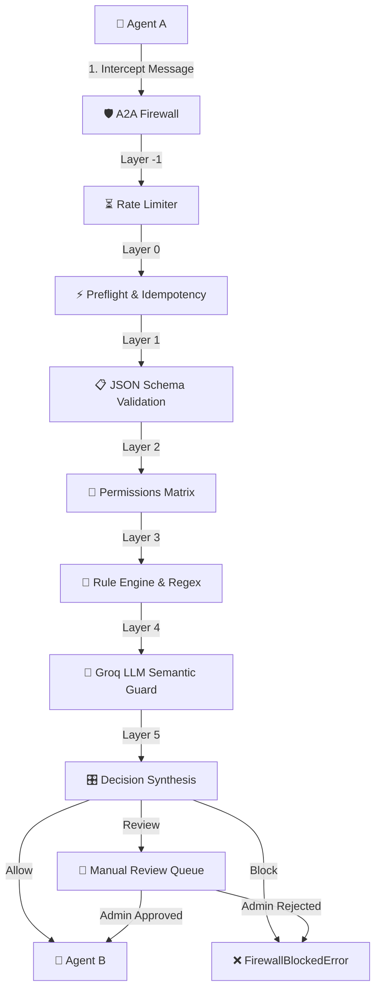

# 🛡️ A2A Firewall — Inter-Agent Governance Mesh

<p align="center">
  
  
  
  
  
</p>

A2A Firewall is a production-grade **Inter-Agent Governance Mesh** designed to intercept, inspect, validate, and trace communication between autonomous AI agents. It ensures security, schema conformity, authorization checks, custom policy enforcement, and distributed lineage tracing across complex multi-agent pipelines.

---

## 🏗️ Architecture & Message Flow

Whenever **Agent A** attempts to send a message to **Agent B**, the request is intercepted by the **A2A Firewall SDK**. The firewall processes the message through a **Multi-Layer Threat Inspection Pipeline** and synthesizes a security decision: **Allow**, **Block**, or route for manual **Review**.



---

## 🛡️ The Inspection Pipeline

| Layer | Component | Description |
| :--- | :--- | :--- |
| **Layer -1** | **Rate Limiter** | Sliding-window limiters restricting queries per minute at both the Workspace level and Agent level. |
| **Layer 0** | **Preflight & Idempotency** | Prevents cascading failures by restricting maximum payload size, circular calls, depth limits (> 10), and replaying cached decisions for duplicate `task_id` submissions. |
| **Layer 1** | **JSON Schema Validation** | Validates the message structure against registered JSON schemas matching the specified `task_type`. |
| **Layer 2** | **Permissions Matrix** | Validates if the sender agent is explicitly authorized to message the receiver agent for that `task_type`. |
| **Layer 3** | **Rule Engine & Policies** | Executes regex matching against forbidden strings (like prompt injection patterns) and custom workspace policies. |
| **Layer 4** | **Groq Semantic Guard** | Uses LLM-based reasoning (via `llama-3.1-8b-instant`) to detect complex prompt injections, jailbreaks, and sensitive data leakage. |
| **Layer 5** | **Decision Synthesis** | Evaluates results from all layers. Decisions falling between the `review_threshold` and `block_threshold` are held in a manual review queue. |

---

## 📊 Observability (OpenTelemetry)

A2A Firewall has native OpenTelemetry instrumentation built-in, allowing you to trace complete multi-agent request chains.

### 1. Local Dev Tracing (Jaeger)
By default, the docker-compose stack starts a Jaeger instance.
* **Dashboard**: [http://localhost:16686](http://localhost:16686)
* **Configuration**: Set in your local backend `.env`:
  ```ini
  OTEL_EXPORTER_OTLP_ENDPOINT=http://localhost:4318
  OTEL_SERVICE_NAME=a2a-firewall
  ```

### 2. Cloud Monitoring (Grafana Cloud / Tempo)
To monitor traces in Grafana Cloud, configure the endpoint and Auth header keys in your `.env` or system environment variables:
```ini
OTEL_EXPORTER_OTLP_PROTOCOL=http/protobuf
OTEL_EXPORTER_OTLP_ENDPOINT=https://otlp-gateway-<your-region>.grafana.net/otlp
OTEL_EXPORTER_OTLP_HEADERS=Authorization=Basic%20<your-base64-encoded-credentials>
```

> [!TIP]
> The SDK handles OTLP headers with or without URL-encoded spaces (`%20` or ` `) seamlessly to support copy-pasted Grafana config generators.

---

## 🚀 Quickstart

### 1. Start the Stack via Docker Compose
Ensure you have Docker Desktop running, then run:
```bash
docker compose up --build -d
```

This starts:
* **Frontend Web Dashboard**: [http://localhost:5173](http://localhost:5173) (Nginx + React)
* **Backend REST API**: [http://localhost:8000](http://localhost:8000) (FastAPI + Uvicorn)
* **API Documentation**: [http://localhost:8000/docs](http://localhost:8000/docs) (Swagger UI)
* **Jaeger Tracing Dashboard**: [http://localhost:16686](http://localhost:16686) (OpenTelemetry)
* **PostgreSQL Database**: [http://localhost:5432](http://localhost:5432)

### 2. Seed the Database
Run the seed script to register a workspace, configure three demo agents (`planner`, `researcher`, `summarizer`), register sample schemas, and generate test keys:
```bash
cd backend
python -m venv .venv
.venv/Scripts/pip install -r requirements.txt

# Run seeding script
.venv/Scripts/python scripts/seed.py
```
> [!IMPORTANT]
> Make sure to copy the outputted API keys and Workspace ID from the terminal!

---

## 🔌 Python SDK Usage

Install the SDK locally:
```bash
cd sdk
pip install -e .
```

### Basic Agent-to-Agent Message Sending
Wrap agent requests using the SDK client. The SDK handles tracing headers, context propagation, and blocks automatically:

```python
from a2a_firewall.client import A2AFirewall, FirewallConfig, FirewallBlockedError

# 1. Configure the Client
config = FirewallConfig(
    firewall_url="http://localhost:8000",
    workspace_id="your-workspace-uuid",
    agent_id="planner-agent-uuid",
    agent_api_key="agt_planner_key",
    fail_mode="closed"  # Options: 'open' (allow on timeout) or 'closed' (block on timeout)
)
firewall = A2AFirewall(config)

# 2. Intercept and Inspect Message
try:
    response = firewall.send(
        receiver_agent_id="researcher-agent-uuid",
        task_type="research",
        payload={
            "query": "What is the capital of France?",
            "max_results": 5
        }
    )
    print(f"Message Allowed! Decision: {response.decision}, Risk: {response.risk_score}")
except FirewallBlockedError as e:
    print(f"Blocked! Task: {e.task_id}, Reason: {e.reason}, Violations: {e.violations}")
```

### Context & Distributed Lineage Tracing
For chained calls (e.g., Planner calling Researcher who then calls Summarizer), propagate the parent task and tracing identifiers:

```python
# In the intermediate agent (Researcher) when handling the task:
firewall.set_context(
    task_id="parent-task-uuid-received",
    root_task_id="root-task-uuid-received",
    trace_id="trace-id-received",
    span_id="span-id-received"
)

# Subsequent send calls will automatically record parent-child relationships in the lineage tree:
firewall.send(
    receiver_agent_id="summarizer-agent-uuid",
    task_type="research",
    payload={"query": "Summarize research data"}
)
```

---

## 🛠️ Developer Setup & Testing

### Backend (FastAPI)
Run checks and unit/integration tests locally:
```bash
cd backend
# Apply database migrations
.venv/Scripts/python -m alembic upgrade head

# Run unit tests
.venv/Scripts/pytest tests/unit -v

# Format, Lint, & Typecheck code
.venv/Scripts/ruff check src
.venv/Scripts/ruff format --check src
.venv/Scripts/mypy src
```

### Frontend (React + Vite)
Build and run the Vite client:
```bash
cd frontend
# Install dependencies
npm ci

# Run development server
npm run dev

# Run Vitest test suite
npm test

# Build client production bundle
npm run build
```

---

## 📊 API Cheat-Sheet

| Endpoint | Method | Description | Auth |
| :--- | :--- | :--- | :--- |
| `/v1/workspaces/register` | `POST` | Register a new developer workspace and get the Admin API Key. | None |
| `/v1/auth/login` | `POST` | Exchange Workspace email for key rotation (DEV only). | None |
| `/v1/agents` | `POST` | Register a new AI Agent within the Workspace. | Bearer (Workspace) |
| `/v1/firewall/inspect` | `POST` | Core hot-path inspection endpoint called by the SDK. | Bearer (Agent) |
| `/v1/tasks/by-trace/{trace_id}` | `GET` | Retrieve task trees and event timelines matching a trace. | Bearer (Workspace/Agent) |
| `/v1/review/{review_token}/decide` | `POST` | Approve or reject a task suspended in the Review Queue. | Bearer (Workspace) |
| `/v1/policies` | `POST` | Create a custom allow/block regex policy rule. | Bearer (Workspace) |
| `/v1/stats/overview` | `GET` | Get general workspace stats, violation percentages, etc. | Bearer (Workspace) |
