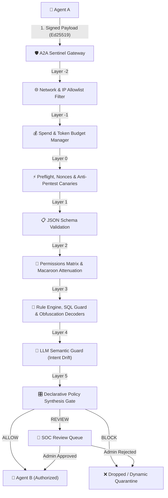

# 🛡️ A2A Firewall — Inter-Agent Governance Mesh & Zero-Trust Security (v2.3.0)

<p align="center">
  
  
  
  
  
  
  
</p>

A2A Firewall is an enterprise-grade **Zero-Trust Inter-Agent Governance Mesh & Security Gateway** designed to intercept, inspect, validate, control spend, and audit communication between autonomous AI agents. It provides multi-layer threat inspection, cryptographic Ed25519 identity verification, Macaroon caveat attenuation, anti-agentic pentest immunity, financial spend governance, fine-grained RBAC, SCIM 2.0 automated provisioning, network-level CIDR filtering, IP allowlisting, and automated data retention controls.

---

## 🏗️ Architecture & Seven-Layer Threat & Governance Pipeline

Whenever **Agent A** attempts to communicate with **Agent B**, the request is intercepted by the **A2A Sentinel Ingress Gateway**. The gateway evaluates network boundaries, financial quotas, schema bounds, and semantic intent before issuing a verdict: **Allow**, **Block**, or route to the **SOC Review Queue**.


```mermaid
flowchart TD
    A["🤖 Agent A"] -->|"1. Signed Payload (Ed25519)"| FW["🛡️ A2A Sentinel Gateway"]
    FW -->|"Layer -2"| L_Net["🌐 Network & IP Allowlist Filter"]
    L_Net -->|"Layer -1"| L_Spend["💰 Spend & Token Budget Manager"]
    L_Spend -->|"Layer 0"| L0["⚡ Preflight, Nonces & Anti-Pentest Canaries"]
    L0 -->|"Layer 1"| L1["📋 JSON Schema Validation"]
    L1 -->|"Layer 2"| L2["🔑 Permissions Matrix & Macaroon Attenuation"]
    L2 -->|"Layer 3"| L3["📜 Rule Engine, SQL Guard & Obfuscation Decoders"]
    L3 -->|"Layer 4"| L4["🧠 LLM Semantic Guard (Intent Drift)"]
    L4 -->|"Layer 5"| L5["🎛️ Declarative Policy Synthesis Gate"]
    
    L5 -->|"ALLOW"| B["🤖 Agent B (Authorized)"]
    L5 -->|"BLOCK"| Err["❌ Dropped / Dynamic Quarantine"]
    L5 -->|"REVIEW"| RQ["👥 SOC Review Queue"]
    
    RQ -->|"Admin Approved"| B
    RQ -->|"Admin Rejected"| Err
```

---

## 🏢 Enterprise Governance & Security Capabilities

### 1. 💰 Spend Limits & Cost Governance (`/dashboard/spend`)
- **Organization & Per-Agent Monthly Budgets**: Set financial quotas (USD) and total token consumption ceilings.
- **Enforcement Actions**: Configurable `block` mode (returns `403 SPEND_LIMIT_EXCEEDED` on limit breach) or `warn` mode (issues SOC alert without dropping message).
- **Inference Cost Ledger**: Tracks heuristic token consumption across models (e.g. GPT-OSS 120B, LLaMA 3.3 70B) with downloadable CSV ledger exports.

### 2. 👥 Role-Based Access Control (RBAC) (`/dashboard/rbac`)
- **Standard Built-in Roles**: `admin`, `security_admin`, `soc_analyst`, `auditor`, `developer`, and `viewer`.
- **Fine-Grained Capabilities**: Permissions tokens (`spend:manage`, `policies:write`, `audit:export`, `network:manage`, `scim:manage`).
- **Custom Security Roles**: Create tailored roles with custom capability subsets.

### 3. 🆔 SCIM 2.0 Identity Provisioning (`/dashboard/scim`)
- **RFC 7643 & RFC 7644 Standard Endpoints**: `/scim/v2/Users`, `/scim/v2/ServiceProviderConfig`, `/scim/v2/Schemas`.
- **Identity Provider Compatibility**: Real-time push synchronization and automatic user deprovisioning from **Okta**, **Microsoft Entra ID (Azure AD)**, and **OneLogin**.
- **OAuth Bearer Token Security**: SHA-256 token hashing at rest with dedicated token rotation.

### 4. 📜 Enterprise Audit Logs & Delegation Lineage (`/dashboard/audit`)
- **System Audit Trail**: Complete immutable ledger of administrative and governance actions (policy modifications, spend limit adjustments, member invites, IP edits, data purges) with JSON diff tracking.
- **Agent Delegation Lineage**: Multi-hop Ed25519 signature validation and cryptographic Macaroon caveat attenuation verifier.
- **Audit-Ready CSV/JSON Export**: Fast extraction for SOC 2 Type II and regulatory auditors.

### 5. 📊 Continuous Compliance & Regulatory Observability (`/dashboard/compliance`)
- **Real-Time Posture Scoring (0-100%)**: Instant compliance metrics across 6 global frameworks:
  - **RBI** (Reserve Bank of India cyber security directions, PAN/Card masking)
  - **DPDP** (Digital Personal Data Protection Act, Aadhaar/PII privacy)
  - **HIPAA** (Health Insurance Portability and Accountability Act)
  - **PCI-DSS** (Payment Card Industry Data Security Standard)
  - **GDPR** & **CCPA** (Global & California Consumer Privacy)
- **One-Click Regulatory Evidence Bundle**: Export pre-compiled audit packages in JSON/CSV format.

### 6. 🗄️ Custom Data Retention & Privacy Controls (`/dashboard/retention`)
- **Granular Lifecycle Windows**: Set retention days for task payloads, telemetry events, violations, and SOC alerts.
- **Compliance Floor Protection**: Audit logs are locked to a minimum of 365 days (1 Year) to satisfy compliance mandates.
- **Automated PII Scrubbing**: Automatically sanitizes Aadhaar, PAN, SSN, Credit Cards, and emails on aging records before permanent pruning.
- **Dry-Run & Scheduled Purge**: Test storage cleanup with dry-run previews before committing deletion.

### 7. 🌐 Network-Level Access Control & IP Allowlisting (`/dashboard/network`)
- **CIDR Subnet Filtering**: Enforce allowed IP addresses and CIDR blocks (`192.168.1.0/24`, `10.0.0.0/16`) for API and Dashboard scopes.
- **Reverse Proxy Header Support**: Safely parses client IPs from `cf-connecting-ip`, `x-forwarded-for`, and `x-real-ip`.
- **Priority Network Rules**: Configure protocol (HTTP, gRPC, WebSocket) and ingress/egress allow/deny matrices.
- **Live Packet Simulator**: Test synthetic IP packets against allowlists and network rules with instant visual verdict feedback.

---

## 🔒 Threat Defense Engines

### 1. Anti-Agentic Pentest Immunity Subsystem
- **Honeytoken Canary Traps**: Decoy canary markers (`__sec_canary`, `_admin_override`, `__probe_eval__`) automatically quarantine malicious reconnaissance agents.
- **Fuzzing Storm Defense**: Detects high-frequency parameter mutations and prompt fuzzing seeds within short burst windows.
- **Introspection Blocker**: Rejects prompt directives attempting to leak internal firewall rule definitions, system prompts, or tool manifests.
- **Dynamic Quarantine**: Offending agents are immediately isolated with session nonces revoked and latency tarpits applied.

### 2. SQL Injection Defense Engine
- Detects `UNION SELECT` credential dumps, tautologies (`OR '1'='1'`, `OR 1=1`), stacked queries (`; DROP TABLE`), comment obfuscations, and time-based blind SQL delays (`PG_SLEEP`, `BENCHMARK`).

### 3. Confused-Deputy & Delegation-Chain Trust Defense
- **Macaroon Caveat Attenuation**: Sub-agent capabilities must be a strict subset of delegator permissions; privilege amplification is strictly blocked.
- **Intent-Binding & Drift Verification**: Multi-hop payloads are scored against root task intent. Drift exceeding threshold (0.7) is immediately blocked.
- **Ed25519 Cryptographic Identity**: Outgoing agent messages carry cryptographic signatures verified against registered public keys.

---

## 🚀 Quickstart

### 1. Start the Stack via Docker Compose
```bash
docker compose up --build -d
```

* **Frontend Web Dashboard**: [http://localhost:3000](http://localhost:3000) (Next.js 16)
* **Backend REST API**: [http://localhost:8000](http://localhost:8000) (FastAPI)
* **API Documentation**: [http://localhost:8000/docs](http://localhost:8000/docs) (Swagger UI)
* **Jaeger Tracing**: [http://localhost:16686](http://localhost:16686) (OpenTelemetry)

### 2. Run Backend Tests
```bash
cd backend
pytest -v
```
*(All 111 unit & integration tests pass cleanly)*

### 3. Build & Run Frontend
```bash
cd frontend
npm install
npm run build
npm run dev
```

---

## 🌐 3-Layer Production Interception & Platform Support Matrix

A2A Firewall employs a three-tier interception and enforcement model designed for enterprise zero-trust deployments:

| Interception Layer | Mechanism | What It Protects | Guarantee Level |
| :--- | :--- | :--- | :--- |
| **Layer 1: Transparent TLS Proxy** (`a2a-proxy`) | Dynamic local Root CA (`ca.crt`) + HTTPS `CONNECT` MITM decryption | All HTTP/HTTPS traffic to OpenAI, Anthropic, Gemini, REST APIs (LangChain, AutoGen, CrewAI) | Zero-code-change inspection & sub-5ms filtering |
| **Layer 2: MCP Tool Gateway** (`a2a_firewall/mcp`) | Structured JSON-RPC 2.0 stdio & HTTP/SSE parser (`tools/call`, `resources/read`) | Model Context Protocol tools, path traversal (`../`), destructive bash commands (`rm -rf`), SQL mutations | Pre-execution tool call block |
| **Layer 3: Kernel eBPF & Egress Guard** (`a2a_firewall/egress_guard`) | Linux `cgroup/connect4` eBPF kernel program + Cross-platform socket monitor | Raw sockets, non-HTTP egress, proxy bypass evasion | **Linux**: Kernel drop.<br>**macOS/Windows**: Process socket audit & auto-kill |

### 📊 Full-Stack Latency & Overhead Benchmark (N=300 runs)

| Stage | Operation | Latency (p50) | Latency (p99) |
| :--- | :--- | :--- | :--- |
| **Normalizer** | Protocol parsing & feature extraction | `0.006 ms` | `0.014 ms` |
| **MCP Policy** | Tool argument & path boundary evaluation | `0.682 ms` | `0.804 ms` |
| **TLS MITM Proxy** | Full TCP connect + TLS MITM termination + Policy Gate | `4.450 ms` | `70.878 ms` |

---

## 🔌 Python SDK Usage

```python
from a2a_firewall.client import A2AFirewall, FirewallConfig, FirewallBlockedError

config = FirewallConfig(
    firewall_url="http://localhost:8000",
    workspace_id="your-workspace-uuid",
    agent_id="planner-agent-uuid",
    agent_api_key="agt_planner_key",
    fail_mode="closed"
)
firewall = A2AFirewall(config)

try:
    response = firewall.send(
        receiver_agent_id="researcher-agent-uuid",
        task_type="research",
        payload={"query": "Summarize renewable energy trends."}
    )
    print(f"Message Allowed! Decision: {response.decision}, Risk: {response.risk_score}")
except FirewallBlockedError as e:
    print(f"Blocked! Task: {e.task_id}, Reason: {e.reason}, Violations: {e.violations}")
```

---

## 📄 License
Apache-2.0 License.
